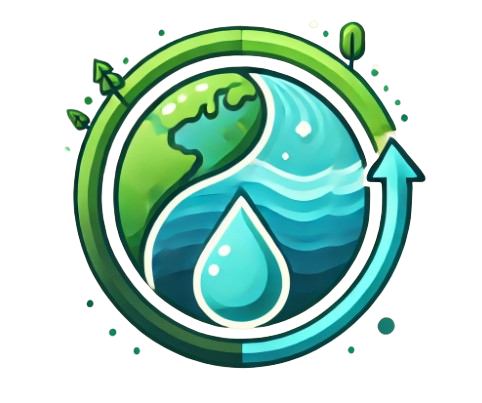

<br>
<h1 align="center"> 🙏🏻High Five 🙏🏻 </h1>


<br>
<p>Hello, we are High Five!</p>
<p>At HighFive, our purpose is to empower individuals to make environmentally conscious fashion choices with ease and confidence. We are dedicated to building an app that educates users on the environmental impact of clothing production, specifically focusing on the water footprint of various materials. By promoting the use of second-hand clothing and sustainable fashion alternatives, we aim to reduce the ecological footprint of the fashion industry. Through insightful data, comparisons, and tips for greener shopping habits, we guide our users toward a more sustainable wardrobe and a healthier planet.</p>
<br>

<h2 align="left">🚀🗂 Languages and Libraries </h2>
<p align="left">
<a></a>
<a></a>
<a></a>
<a></a>
</p>

<h2 align="left">🔧 Used Tools </h2>
<p align="left">
<a href="https://code.visualstudio.com/"></a>
<a></a>
 <a href="https://teams.microsoft.com/_?culture=en-us&country=us#/conversations/19:b01cf915e57b430ea93ab780c4f6b6dc@thread.v2?ctx=chat"></a>
    <a href="https://git-scm.com/"></a>
   <a href="https://www.microsoft.com/en-ww/microsoft-365/word"></a>
   <a href="https://www.microsoft.com/en-us/microsoft-365/powerpoint">
   <a href="https://freelogopng.com/image/607"></a>
   <a></a>

 <br>

<h2 align="left">📄📎 Documents</h2><br>
  <ul>
    <li><a href="[https://codingburgas-my.sharepoint.com/:p:/g/personal/zvyankova22_codingburgas_bg/EZqYdkRO07NFjPvcuTjo1I4B92fdZ2lkoUvLkiV39Iv__Q?e=hyJf0d](https://codingburgas-my.sharepoint.com/:p:/g/personal/kkivanov22_codingburgas_bg/EX131FXBiRxBpaoSzhFMUYYBmQ0fK-jt3QaZi4VPTKzjbw?e=uQCDFX)">Presentation</a></li>
    <li><a href="https://codingburgas-my.sharepoint.com/:v:/g/personal/kkivanov22_codingburgas_bg/EUnermU4XsNMjcceJyDkQXYBdjF9Gshe3GRrM3HojUOTsA?nav=eyJyZWZlcnJhbEluZm8iOnsicmVmZXJyYWxBcHAiOiJPbmVEcml2ZUZvckJ1c2luZXNzIiwicmVmZXJyYWxBcHBQbGF0Zm9ybSI6IldlYiIsInJlZmVycmFsTW9kZSI6InZpZXciLCJyZWZlcnJhbFZpZXciOiJNeUZpbGVzTGlua0NvcHkifX0&e=Pe6kXI">Video</a></li>
  </ul>  

<h2 align="left">👨🏻‍💻 Team Members </h2>
<table >
  <tr>
    <td align="center">Name</td>
    <td align="center">Role</td>
    <td align="center">Grade</td>
    <td align="center">Github</td>
  </tr>
  <tr>
    <td align="center"> Zhaklin Yankova</td>
    <td align="center">Design Thinker</td>
    <td align="center">🟥 10B</td>
    <td align="center"> <a href="https://github.com/ZVYankova22">ZVYankova22 </a></td>
  </tr>
  <tr>
    <td align="center">Stiliyan Dimitrov</td>
    <td align="center">Data Analyst</td>
    <td align="center">🟥 10B</td>
    <td align="center"> <a href="https://github.com/SKDimitrov22">SKDimitrov22 </a></td>
  </tr>
  <tr>
    <td align="center">Dimaya Noneva</td>
    <td align="center">Researcher & Ethicist</td>
    <td align="center">🟥 10B</td>
    <td align="center"> <a href="https://github.com/DHNoneva22">DHNoneva22 </a></td>
  </tr>
    <tr>
    <td align="center">Stoyan Hristov</td>
    <td align="center">Frontend & Prototyping</td>
    <td align="center">🟥 10B</td>
    <td align="center"> <a href="https://github.com/SPHristov22">SPHristov22 </a></td>
  </tr>
  <tr>
    <td align="center">Kaloyan Ivanov </td>
    <td align="center">Backend Developer</td>
    <td align="center">🟥 10B</td>
    <td align="center"> <a href="https://github.com/KKIvanov22">KKIvanov22 </a></td>
  </tr>
</table>
<br>

 <h2 align="left">🔒🔑 Access</h2>

 <p> Open cmd and clone our repo by typing</p>

```
https://github.com/KKIvanov22/HighFive.git
```
<p>Thank you for scrolling this far! Show some 🤍 by starring the repo!</p>

